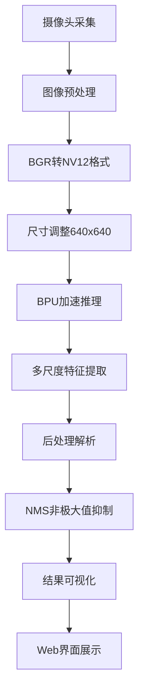

# RDK X5 鱼类疾病智能检测系统

## 项目简介

这是一个基于RDK X5开发板的鱼类疾病智能检测系统，采用YOLOv11深度学习模型进行实时鱼类疾病识别。系统利用RDK X5的BPU加速推理能力，通过网页界面展示实时检测结果，可准确识别22种常见鱼类疾病。

## 功能特点

- 🐟 **专业鱼类疾病检测**：基于YOLOv11架构，专门训练用于鱼类疾病识别
- 🚀 **硬件加速推理**：利用RDK X5的BPU加速单元，实现高效实时推理
- 🌐 **Web实时监控**：通过Flask提供美观的网页界面，实时查看检测结果
- 📊 **性能监控**：实时显示FPS性能指标，监控系统运行状态
- 🔄 **多线程处理**：并行处理视频流和推理任务，保证系统稳定性
- 🎯 **高精度识别**：支持22种鱼类疾病的精确识别和分类
- 🛠️ **灵活配置**：支持多种参数调节，适应不同应用场景

## 支持的鱼类疾病检测类别

本系统可识别以下22种鱼类疾病：

### 细菌性疾病
1. **气单胞菌败血症** - 常见的细菌性全身感染
2. **柱状病** - 由柱状黄杆菌引起的疾病
3. **细菌性红斑病** - 表现为皮肤红斑的细菌感染
4. **流行性溃疡** - 严重的细菌性溃疡疾病
5. **细菌性鳃病** - 影响鱼类呼吸系统的细菌感染
6. **链球菌** - 链球菌感染引起的疾病

### 真菌性疾病
7. **真菌腐皮病** - 真菌感染导致的皮肤腐烂

### 寄生虫疾病
8. **白点病** - 小瓜虫感染引起的常见疾病
9. **寄生虫病** - 各种寄生虫感染的总称

### 病毒性疾病
10. **罗湖病** - 病毒性疾病
11. **白斑综合征** - 严重的病毒性疾病

### 其他疾病
12. **溃疡** - 各种原因引起的溃疡性病变
13. **烂鳃** - 鳃部腐烂性疾病
14. **气损伤** - 气体相关的损伤
15. **眼病** - 眼部疾病
16. **黑斑病** - 皮肤黑斑病变
17. **黑鳃病** - 鳃部黑化疾病

### 特定鱼种疾病
18. **金鱼** - 健康金鱼识别
19. **金鱼水肿** - 金鱼特有的水肿病
20. **金鱼白点病** - 金鱼的白点病
21. **金鱼败血症** - 金鱼的败血症

### 健康状态
22. **健康鱼** - 健康鱼类的识别

## 系统要求

### 硬件要求
- **RDK X5开发板** - 必须，系统专为RDK X5的BPU优化
- **USB摄像头** - 用于实时图像采集
- **网络连接** - 用于Web界面访问

### 软件要求
- **操作系统**: Ubuntu 20.04 (RDK X5官方系统)
- **Python**: 3.8+
- **核心依赖库**:
  - `hobot_dnn` - RDK X5 BPU推理库
  - `opencv-python` - 图像处理
  - `numpy` - 数值计算
  - `scipy` - 科学计算
  - `flask` - Web服务框架

## 快速开始

### 1. 环境准备

确保RDK X5开发板已正确安装系统并连接网络。

### 2. 模型文件准备

将训练好的鱼类疾病检测模型文件放置在指定目录：
```bash
# 默认模型路径
models/yolo11n_detect_bayese_640x640_nv12.bin
```

### 3. 运行应用

#### 基础运行
```bash
python APP.py
```

#### 自定义参数运行
```bash
python /app/最终目标检测代码/yolo_app.py --model-path /app/最终目标检测代码/model/converted_model.bin --camera-id 0 --port 8080
```

### 4. 命令行参数详解

| 参数 | 类型 | 默认值 | 描述 |
|------|------|--------|------|
| `--model-path` | str | `models/yolo11n_detect_bayese_640x640_nv12.bin` | BPU量化模型文件路径 |
| `--camera-id` | int | `0` | 摄像头设备ID |
| `--port` | int | `8080` | Web服务器端口号 |
| `--conf-thres` | float | `0.25` | 检测置信度阈值 (0.0-1.0) |
| `--iou-thres` | float | `0.45` | NMS IoU阈值 (0.0-1.0) |
| `--classes-num` | int | `22` | 检测类别总数 |
| `--class-offset` | int | `0` | 类别ID偏移量，用于模型输出校正 |
| `--debug` | flag | `False` | 启用调试模式，输出详细日志 |
| `--use-english` | flag | `False` | 使用英文类别名称显示 |

### 5. 访问Web监控界面

应用启动后，系统会自动显示访问地址：
```
启动Web服务器在 http://[RDK_X5_IP]:8080
```

在浏览器中打开该地址即可查看实时检测结果。

## 技术架构

### 深度学习模型
- **网络架构**: YOLOv11轻量级目标检测网络
- **输入尺寸**: 640×640像素
- **输出格式**: 多尺度特征图（小、中、大三个检测头）
- **模型优化**: 专门针对RDK X5 BPU进行量化优化
- **检测精度**: 支持22种鱼类疾病的高精度识别

### 系统处理流程



#### 详细处理步骤
1. **图像采集**: 从USB摄像头实时捕获视频帧
2. **预处理**:
   - BGR格式转换为NV12格式（BPU优化格式）
   - 图像尺寸调整至640×640
3. **BPU推理**:
   - 使用hobot_dnn API调用BPU加速单元
   - 多尺度特征提取和疾病特征识别
4. **后处理**:
   - 解析网络输出的边界框和类别信息
   - 应用NMS算法去除重复检测
   - 置信度阈值过滤
5. **结果展示**:
   - 在图像上绘制检测框和疾病标签
   - 通过Flask实时推送到Web界面

### 性能优化特性

- **硬件加速**: 充分利用RDK X5的BPU计算能力
- **内存优化**: 高效的图像格式转换和内存管理
- **多线程处理**: 推理和视频流并行处理
- **实时性保证**: 优化的后处理算法确保低延迟

## Web界面功能

### 主要特性
- 🖥️ **实时视频流**: 显示带有检测结果的实时视频
- 📈 **性能监控**: 实时FPS显示
- 🎨 **美观界面**: 响应式设计，支持多种设备访问
- 🔍 **检测信息**: 显示检测到的疾病类型和置信度

### 界面布局
- **标题区域**: 显示系统名称和状态
- **视频区域**: 实时检测视频流
- **信息区域**: FPS和检测统计信息

## 应用场景

### 水产养殖业
- **疾病早期发现**: 及时识别鱼类疾病，减少损失
- **健康监控**: 持续监控鱼群健康状态
- **养殖管理**: 辅助养殖户进行科学管理

### 科研教育
- **疾病研究**: 为鱼类疾病研究提供数据支持
- **教学演示**: 用于水产养殖相关课程教学
- **技术验证**: 验证AI在水产领域的应用效果

## 故障排除

### 常见问题

#### 1. 模型加载失败
```bash
❌ Failed to load model file: models/xxx.bin
```
**解决方案**:
- 检查模型文件路径是否正确
- 确认模型文件格式为RDK X5兼容的.bin格式
- 验证文件权限和完整性

#### 2. 摄像头无法打开
```bash
无法打开摄像头 ID: 0
```
**解决方案**:
- 检查摄像头连接状态
- 尝试不同的camera-id值（0, 1, 2...）
- 确认摄像头驱动正常

#### 3. Web界面无法访问
**解决方案**:
- 检查防火墙设置
- 确认端口未被占用
- 验证网络连接状态

### 调试模式
启用调试模式获取详细日志：
```bash
python APP.py --debug
```

## 更新日志

### v1.0.0 (2024-12)
- ✅ 实现基于YOLOv11的鱼类疾病检测
- ✅ 支持22种常见鱼类疾病识别
- ✅ 集成RDK X5 BPU硬件加速
- ✅ 提供Web实时监控界面
- ✅ 多线程优化保证系统稳定性
- ✅ 完善的参数配置和调试功能

## 注意事项

⚠️ **重要提醒**:
- 本系统专为RDK X5开发板设计，无法在普通PC上运行
- 需要使用专门训练的鱼类疾病检测模型
- 检测精度受光照条件、水质清澈度等环境因素影响
- 建议在稳定的网络环境下使用Web界面

## 技术支持

### 开发团队
**Copyright (c) 2024, WuChao D-Robotics**

### 许可证
本项目基于 **Apache 2.0** 许可证开源

### 贡献指南
欢迎提交Issue和Pull Request来改进项目

---

*本项目是RDK X5嵌入式AI应用的典型示例，展示了边缘计算在智能水产养殖领域的应用潜力。*